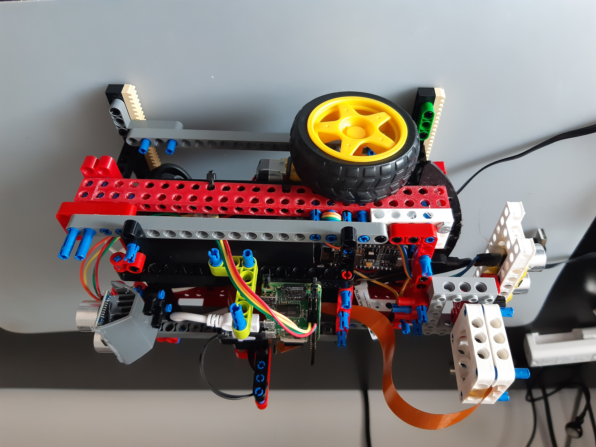

# Robot
Robot car with nodemcu v2

Source: 

https://www.instructables.com/id/Simplest-Wifi-Car-Using-ESP8266-Motorshield/

https://www.instructables.com/id/WiFi-Car-Using-NodeMCU/

# Chassis 
Aim was to build platform easy to expand.
Tested Ideas : 

[bitbeam](https://github.com/e-Mole/m-Bitbeam_Parts_for_3Dprint "Bitbeam")
[pela](https://github.com/marcindus/PELA-blocks "Pela")


# Building tests

```bash
mkdir build
cd build
cmake ..
make
./tests
```

# Building with platformio (and upload)

```bash
pio run
pio run -t upload
```
# Images (outdated)





